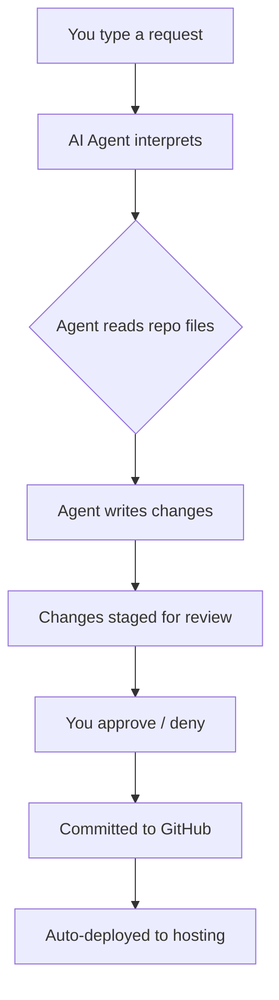
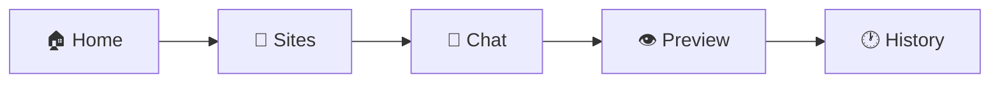
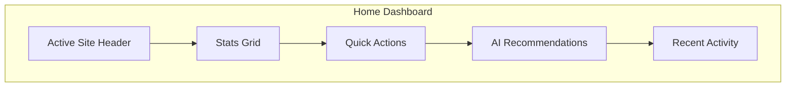
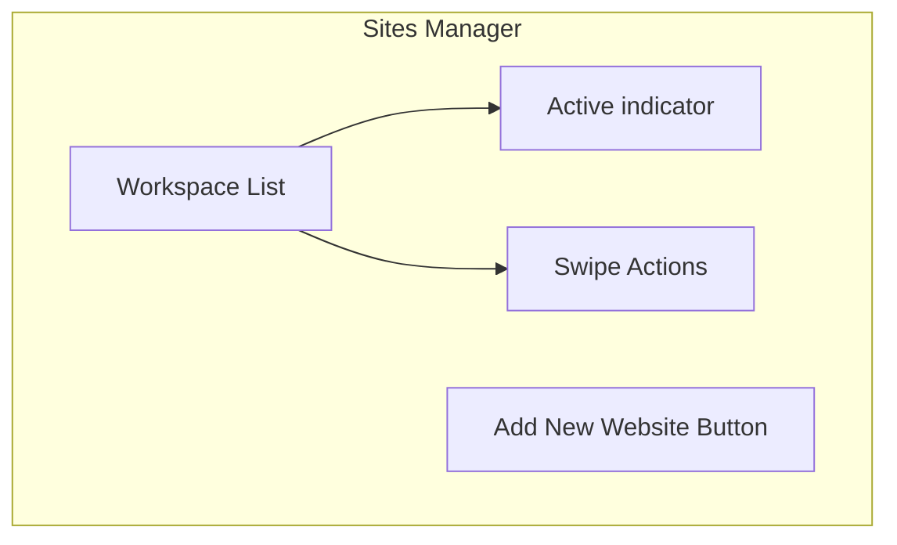
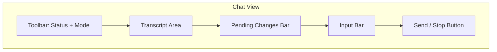
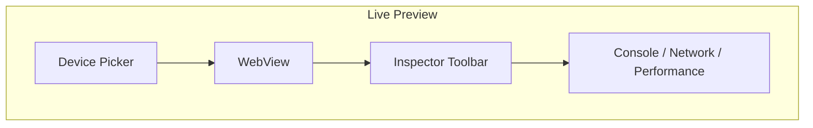
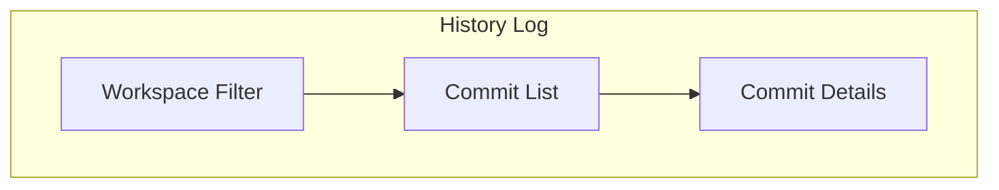
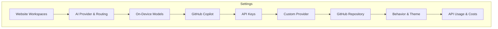
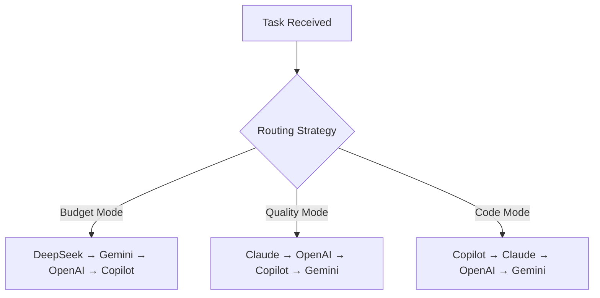

# Website Commander — User Guide

> **Version:** 1.0  
> **Platform:** iOS (iPhone)  
> **Tech Stack:** SwiftUI, GitHub REST API, Multiple LLM Providers

---

## Table of Contents

1. [What is Website Commander?](#1-what-is-website-commander)
2. [Getting Started (Onboarding)](#2-getting-started-onboarding)
3. [Main Navigation (Tab Bar)](#3-main-navigation-tab-bar)
4. [Home — Command Center](#4-home--command-center)
5. [Sites — Website Manager](#5-sites--website-manager)
6. [Chat — AI Agent](#6-chat--ai-agent)
7. [Preview — Live Site Preview](#7-preview--live-site-preview)
8. [History — Commit Log](#8-history--commit-log)
9. [Settings](#9-settings)
10. [Sheets & Modals](#10-sheets--modals)
11. [AI Providers & Routing](#11-ai-providers--routing)
12. [Frequently Asked Questions](#12-frequently-asked-questions)

---

## 1. What is Website Commander?

**Website Commander** is an iOS app that lets you manage and edit websites directly from your iPhone using natural language. It connects to GitHub repositories, uses AI models (cloud or on-device) to understand your requests, makes file changes, and commits them — all from a chat interface.

### Core Features

- **Natural Language Editing:** Describe changes in plain English
- **Multi-Provider AI:** Choose from DeepSeek, Claude, OpenAI, Gemini, Grok, Mistral, GitHub Copilot, or on-device models
- **Smart Auto-Routing:** Automatically picks the best AI model for each task
- **Visual Diff Review:** See exactly what changed before approving
- **Live Preview:** Preview the website with changes applied, in mobile/tablet/desktop views
- **Web Inspector:** Debug with console logs, network monitoring, element inspection
- **Security Scanning:** Automatic risk detection in staged changes
- **On-Device AI:** Run models locally (iPhone 15 Pro+) — no internet needed
- **OAuth Sign-In:** One-tap authentication with GitHub, Anthropic, and OpenAI

---

## 2. Getting Started (Onboarding)

When you first launch Website Commander, you are greeted with a **5-page onboarding carousel**:

| Page | Title | Description |
|------|-------|-------------|
| 1 | **Welcome to Website Commander** | Overview — edit files with plain English, autonomous validation, local or cloud AI |
| 2 | **Autonomous Loops** | Auto-validates syntax, self-corrects errors, side-by-side visual diffs |
| 3 | **Visual Debugger** | Live JS console, network traffic monitor, DOM inspector |
| 4 | **Security & Privacy** | Credentials stored in iOS Keychain, no proxy servers, direct API calls |
| 5 | **Disclaimer & Safety** | AI models may have errors — you are responsible for all approved code |

Tap **Continue** to progress through the pages, or **Skip** to dismiss. On the last page, tap **Get Started** to enter the app.

---

## 3. Main Navigation (Tab Bar)

After onboarding, the app presents a **5-tab layout** at the bottom of the screen:

| Tab | Icon | Name | Purpose |
|-----|------|------|---------|
| 1 | `house` | **Home** | Dashboard with stats, quick actions, AI recommendations |
| 2 | `folder` | **Sites** | Manage connected website workspaces |
| 3 | `message` | **Chat** | Talk to the AI agent to make changes |
| 4 | `eye` | **Preview** | Live preview of your website |
| 5 | `clock` | **History** | View commit history for any workspace |

---

## 4. Home — Command Center

The **Home** tab is your main dashboard, called the **Command Center**.

### 4.1 Active Site Header

Shows the currently active workspace name. Tap the dropdown menu to switch between workspaces. A green dot means the workspace is fully configured and ready.

### 4.2 Stats Grid

Four cards showing at-a-glance information:

| Stat | Description |
|------|-------------|
| **Connected Sites** | Total number of workspaces configured |
| **Changes Staged** | Number of pending file changes awaiting approval |
| **Provider Cost** | Estimated cost for the active AI provider |
| **Provider** | Name of the currently active AI provider |

### 4.3 Quick Actions

Three action buttons:

| Action | Description |
|--------|-------------|
| **New Chat** | Opens the Chat tab with a fresh conversation |
| **Add Site** | Opens the "Add Workspace" sheet to connect a new website |
| **Preview** | Opens the Preview tab to see the live site |

> **Note:** Adding more than one site requires a **Super** subscription.

### 4.4 AI Recommendations

Horizontally scrollable suggestion cards that you can tap to instantly send a pre-made prompt to the agent:

- **Optimize for SEO** — Audits search keywords and meta tags
- **Update Project Status** — Promotes beta tools to live versions

### 4.5 Recent Activity

Shows the 4 most recent commits from the active workspace's GitHub repository. Tapping a commit isn't interactive — it's just a read-only log.

### 4.6 Setup Card

If the workspace isn't fully configured, a **Setup Card** appears listing exactly what's missing (e.g., "Connect a website", "Add your API key", "Add a GitHub token").

### 4.7 Toolbar

- **Settings gear icon** (top-right) — Opens the Settings sheet

---

## 5. Sites — Website Manager

The **Sites** tab lets you manage all connected website workspaces.

### 5.1 Workspace List

Each workspace shows:

- **Icon** — Tech stack symbol (globe for HTML, sparkles for Astro, etc.)
- **Name** — Your custom name for the site
- **Slug** — GitHub `owner/repo` path
- **Tech Stack badge** — e.g., "Vanilla HTML/JS", "Next.js", "Astro", "Hugo", etc.
- **Deployment badge** — e.g., "Cloudflare Pages", "Vercel", "Netlify", "GitHub Pages", "SSH/SFTP"
- **Active tag** — Green badge on the currently selected workspace

### 5.2 Swipe Actions

Swipe left on a workspace row to reveal:

| Action | Description |
|--------|-------------|
| **Delete** (red) | Removes the workspace from the app |
| **Edit** (blue) | Opens the workspace editor sheet |

### 5.3 Add New Website

Tap the button to open the **Add Workspace** sheet (detailed in §10.3).

---

## 6. Chat — AI Agent

The **Chat** tab is the core of Website Commander. It provides a conversational interface to an AI agent that can read, write, and manage your website's files on GitHub.

### 6.1 Toolbar

| Element | Description |
|---------|-------------|
| **Left: Status Dot** | Green = ready; animated = working |
| **Center: Model Info** | Shows workspace name + model (or "Auto-Route" if smart routing is on) |
| **Right: History button** | Opens conversation history |
| **Right: New Chat button** | Resets the conversation |

### 6.2 Transcript Area

The main scrollable area displays the conversation history:

- **User messages** — Your requests
- **Assistant messages** — AI responses with tool events
- **Tool Events** — Inline records of files read, written, or searched
- **Typing Indicator** — Shows "Working…" while the agent is processing
- **Proposed Agent Plan** — When the AI suggests a plan of action

### 6.3 Empty State & Templates

When no conversation exists, the chat shows a set of **command templates** (horizontally scrollable):

| Template | Prompt |
|----------|--------|
| **Add Project** | Add a new app to the portfolio |
| **Update Bio & Photo** | Update About page text/picture |
| **Optimize for SEO** | Audit & fix meta tags, headings |
| **Update App Status** | Change project status |
| **Content Sync Check** | Verify bilingual content matches |

### 6.4 Input Bar

The input area includes:

| Feature | Description |
|---------|-------------|
| **Text Field** | Type your request in plain English |
| **Attach Button (+)** | Opens action sheet to add photos or files |
| **Attachment Strip** | Shows attached files horizontally |
| **Send Button** | Sends the message to the agent |
| **Stop Button** | Cancels the current agent run |

### 6.5 Attachments

You can attach files to your messages:

- **Photos** — From your photo library (sent to vision-capable models)
- **Files** — Any file from the Files app
- **Vision Warning** — If the active provider doesn't support images, a warning banner appears

### 6.6 Pending Changes Bar

When the agent has staged changes awaiting your approval, a bar appears above the input with:

- **Count** — Number of pending changes
- **Change rows** — Each change with icon (color-coded by category), file path, and category label
- **Approve All button** — Commits all pending changes at once
- **Tap a change** — Opens the **Diff Sheet** for detailed review

### 6.7 Session Limits

- **Free users:** 8 agent sessions per month
- **Super users:** Unlimited sessions
- **On-device:** 3-day free trial, then Super required

---

## 7. Preview — Live Site Preview

The **Preview** tab lets you see your website rendered right in the app, with staged changes applied.

### 7.1 Device Picker

Toggle between three viewport sizes:

| Mode | Icon | Size |
|------|------|------|
| **Mobile** | `iphone` | 390×844 px (rounded frame) |
| **Tablet** | `ipad` | 768×1024 px (rounded frame) |
| **Desktop** | `macbook` | Full width (no frame) |

### 7.2 WebView

The site is rendered inside a `WKWebView` with all staged changes applied. Loading state shows a progress indicator. Errors display a retry button.

### 7.3 Inspector Panel (Super Feature)

When inspector is enabled, a floating glassmorphism toolbar appears at the bottom:

| Feature | Description |
|---------|-------------|
| **Console** | View JavaScript console logs (filterable by All/Logs/Warnings/Errors) |
| **Network** | Monitor network requests with status codes, timing, sizes |
| **Performance** | View load time, DOM ready time, JS heap usage |
| **Element Inspector** | Tap any element to see its tag, classes, styles, selector, and XPath |

The inspector also has an **Inspect Mode** toggle — when active, a yellow banner says "Tap any element on preview to inspect", and tapping elements reveals their DOM info.

> **Note:** Inspector requires a **Super** subscription for workspaces with pending changes.

### 7.4 No Workspace State

If no workspace is active, a prompt appears asking you to choose a site in the Home or Sites tab.

---

## 8. History — Commit Log

The **History** tab shows the commit history for your workspaces.

### 8.1 Workspace Filter

A dropdown picker lets you filter by:

- **Active Workspace** (default) — Shows commits for the currently selected site
- Any individual workspace you've configured

### 8.2 Commit List

Each commit entry shows:

| Element | Description |
|---------|-------------|
| **Branch icon** | Visual indicator |
| **Commit message** | The commit description |
| **Author** | Who made the commit |
| **Date** | Formatted date & time |
| **Short SHA** | First 7 characters of the commit hash |

---

## 9. Settings

The **Settings** sheet (accessible from the Home toolbar or Chat toolbar) is organized into multiple sections.

### 9.1 Website Workspaces

- Lists all configured workspaces with checkmark for active
- Tap a workspace to select it
- Swipe to delete
- Tap info icon to edit
- **Add New Website** button

### 9.2 AI Provider & Routing

- **Provider Picker** — Select from available providers (DeepSeek, Claude/Anthropic, OpenAI, GitHub Copilot, Grok, Mistral, Gemini, On-Device)
- **Model Picker** — Choose a specific model for the selected provider
- **Refresh Model List** — Fetch latest models from the provider
- **Smart Auto-Routing toggle** (Super) — Automatically picks the best model
- **Routing Strategy** (Super) — Budget Mode, Quality Mode, or Code Mode
- GitHub Copilot is available on the free app tier; other cloud providers require Super

### 9.3 On-Device Models (iPhone 15 Pro+)

- **Status** — Shows Super/trial status and loaded model info
- **Activation toggle** — Enable on-device for the agent
- **Model catalog** — Downloadable 4-bit MLX models with download progress
- Free 3-day trial, then Super required

### 9.4 GitHub Copilot

- **Sign In** — Uses OAuth device flow (enter a code on github.com)
- **Sign Out** — Removes Copilot authentication
- Available on the free app tier; requires an active GitHub Copilot plan on your GitHub account

### 9.5 API Keys

Enter keys for any provider:

| Provider | Key Source |
|----------|-----------|
| Claude (Anthropic) | console.anthropic.com/settings/keys |
| DeepSeek | platform.deepseek.com/api_keys |
| OpenAI | platform.openai.com/api-keys |
| Grok (xAI) | console.x.ai |
| Mistral | console.mistral.ai/api-keys |
| Gemini (Google) | aistudio.google.com/app/apikey |

> All keys are stored exclusively in the iOS **Keychain**.

### 9.6 Custom Provider

Configure a custom OpenAI-compatible provider:
- **Base URL** — The API endpoint
- **Model name** — The model identifier
- **API key** — Authentication key

### 9.7 GitHub Repository

Configure the GitHub connection:

| Field | Description |
|-------|-------------|
| **Owner** | GitHub username or organization |
| **Repo** | Repository name |
| **Branch** | Target branch (default: `main`) |

Authentication options:
- **Sign in with GitHub** — OAuth device flow (recommended, always grants write access)
- **Manual token** — Classic Personal Access Token with `repo` scope
- **Test Connection** — Verifies the token can read AND write

### 9.8 Behavior & Theme

| Setting | Description |
|---------|-------------|
| **Auto-commit** | Skip approval — commit changes immediately |
| **OLED Dark Mode** | True black backgrounds for OLED screens |
| **Haptic Feedback** | Toggle vibration feedback on/off |
| **Replay Welcome Tour** | Replay the onboarding screens |

### 9.9 API Usage & Costs

Shows per-provider token usage statistics:
- Prompt tokens count
- Completion tokens count
- Estimated cost (USD)
- **Reset Stats** button

For Copilot, shows "$0.00" for Website Commander usage because billing is covered by the user's own GitHub Copilot plan.

### 9.10 About Section

Shows which site is being managed and its deployment method's redeploy note.

---

## 10. Sheets & Modals

### 10.1 Add File Sheet

Accessed from the File Browser. Lets you add files directly to the repo:

| Option | Description |
|--------|-------------|
| **Type picker** | Text file, Photo, or File |
| **Folder** | Shows destination directory |
| **File name** | Name of the new file |
| **Contents** | For text files: an editor; for photos: image picker; for files: file importer |
| **Commit message** | Description of what you're adding |

### 10.2 Edit File Sheet

Opened by tapping the pencil icon in the File Viewer. Provides:
- Path display
- Full file content editor (monospaced)
- Commit message field
- **Save** and **Cancel** buttons

### 10.3 Add/Edit Workspace Sheet

A comprehensive form for connecting a GitHub repository:

| Section | Fields |
|---------|--------|
| **Workspace** | Name |
| **Repository** | GitHub Owner, Repository name, Branch |
| **Environment** | Tech Stack (Vanilla HTML, Next.js, Astro, Hugo, Jekyll, SvelteKit, Eleventy, Custom), Deployment type (Cloudflare Pages, Vercel, Netlify, GitHub Pages, SSH/SFTP) |
| **Agent** | Default model, Custom rules |

### 10.4 Diff Sheet (Change Review)

Opened by tapping a pending change. Provides a full review interface:

| Tab | Description |
|-----|-------------|
| **Diff** | Line-by-line comparison (green = added, red = removed) |
| **Preview** | Live site preview with this change applied |
| **Files** | List of all staged files |

Features:
- **Risk banner** — Security scan findings (eval(), external scripts, etc.)
- **Risk score** — High/Medium/Low based on change size
- **Change category** — Content, Design/CSS, Structural, Assets
- **Stats** — Lines added/removed
- **Deploy note** — Provider-specific post-commit message

### 10.5 Super Paywall

Unlocks premium features:
- Unlimited connected sites
- Paid cloud AI providers (Claude, OpenAI, DeepSeek, Gemini, Grok, Mistral, custom)
- Advanced Web Inspector (Console + Network + Elements)
- Unlimited monthly sessions

Plans:
- **Monthly** — $1.99/month
- **Lifetime** — $19.99 (one-time)

### 10.6 Conversation History Sheet

Lists all saved conversations sorted by date. Tap to restore a previous conversation.

### 10.7 On-Device Settings

Manage local AI models:
- Status indicator (trial/Super/unsupported)
- Activation toggle
- Model list with download/delete controls

---

## 11. AI Providers & Routing

### 11.1 Available Providers

| Provider | ID | Super Required | Vision Support |
|----------|----|-------------|----------------|
| **GitHub Copilot** | `copilot` | No | Yes |
| **DeepSeek** | `deepseek` | **Yes** | Yes |
| **Anthropic (Claude)** | `anthropic` | **Yes** | Yes |
| **OpenAI** | `openai` | **Yes** | Yes |
| **Grok (xAI)** | `grok` | **Yes** | Yes |
| **Mistral** | `mistral` | **Yes** | Yes |
| **Gemini (Google)** | `gemini` | **Yes** | Yes |
| **On-Device** | `ondevice` | Trial/Super | No |

### 11.2 Smart Auto-Routing

When enabled (Super feature), Website Commander automatically picks the best model based on the task:

| Strategy | Best For | Priority Order |
|----------|----------|----------------|
| **Budget Mode** | Cost-sensitive tasks | DeepSeek > Gemini > OpenAI > Copilot |
| **Quality Mode** | Complex planning/reasoning | Claude > OpenAI > Copilot > Gemini |
| **Code Mode** | Code generation/editing | Copilot > Claude > OpenAI > Gemini |

### 11.3 On-Device Models

Available on iPhone 15 Pro and newer. Uses 4-bit quantized MLX models. No internet required. Free for 3 days, then Super required.

---

## 12. Frequently Asked Questions

**Q: How do I get started?**  
A: Complete onboarding, then go to Settings to: (1) Add a website workspace, (2) Add a GitHub token or sign in with GitHub, (3) Add an API key for your chosen AI provider.

**Q: What happens when I send a message?**  
A: The AI agent reads your repository files, plans changes, stages them, and presents a diff for your approval. You review and tap "Approve all" to commit to GitHub.

**Q: Is my API key safe?**  
A: Yes. All credentials are stored exclusively in the iOS Keychain. The app makes direct API calls — no proxy servers or telemetry.

**Q: How many sites can I manage?**  
A: Free users: 1 site. Super users: unlimited.

**Q: What's the free session limit?**  
A: Free users get 8 agent sessions per month. Super users get unlimited sessions.

**Q: Can I use this without internet?**  
A: If you have an iPhone 15 Pro or newer, you can download on-device models and use them offline (free for 3 days, then Super required).

**Q: What tech stacks are supported?**  
A: Vanilla HTML/JS, Next.js, Astro, Hugo, Jekyll, SvelteKit, Eleventy, and Custom.

**Q: What deployment platforms are supported?**  
A: Cloudflare Pages, Vercel, Netlify, GitHub Pages, and SSH/SFTP.

---

*Document generated on 2026-06-15 from the Website Commander source code.*
